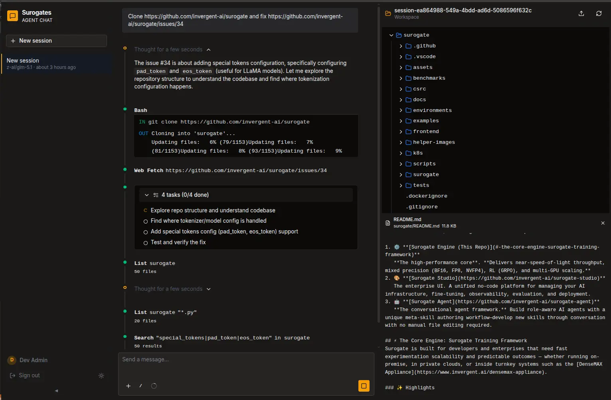

# Surogates

**Open platform for running managed agents at scale**, built around a clear separation between reasoning (“brain”) and execution (“hands”). It supports multi-tenancy and incorporates enterprise-grade security, making it well-suited for production deployments.


The platform is **model-agnostic**, allowing you to use your preferred LLM provider without lock-in. It also includes **a robust tool system, seamless channel integrations**, and a **durable session architecture** designed for reliability and horizontal scalability.


This makes Surogates more **resilient, scalable, and secure** than existing open agent frameworks, and a better fit **for enterprise use cases**. 





Unlike developer-focused agent harnesses, Surogates is **purpose-built for multi-tenant, multi-user environments. It does not provide a TUI or CLI for direct agent interaction**. Instead, users engage with agents exclusively through external channels such as web chat or messaging platforms (e.g., Slack, Teams, Telegram).

Surogates takes a fundamentally different approach from personal agent frameworks like *OpenClaw*, *Hermes Agent*, *NemoClaw*, *LangSmith*, etc. which are typically designed for single-user workflows and often run the agent loop and tools within the same process.


## Architecture

**Surogates** decouples the session, harness, and sandbox so each can fail, scale, and be replaced independently:

- the session is a durable append-only event log. 
- the harness (brain) are stateless workers that drive the LLM loop. 
- the sandbox (hands) is an isolated execution environment reached via tool calls. One sandbox per session, lazily provisioned, destroyed when the session ends.

No component assumes anything about the others beyond a small set of interfaces. This means if the harness crashes, a new one can pick up where it left off by replaying the session log. If the sandbox dies, the harness can provision a new one and continue. The API server is the only component with access to tenant-level credentials (DB, S3) and issues scoped tokens to the workers, which in turn manage sandbox credentials.

```
┌─────────────────────────────────────────────────────────────┐
│                         User Channels                       │
│                                                             │
│     Web Chat UI  │  Slack  │  Teams  │  Telegram  │  ...    │
└───────────────────────────────┬─────────────────────────────┘
                                │
┌───────────────────────────────┴─────────────────────────────┐
│                   API Server Control Plane                  │
│                                                             │
│    FastAPI gateway, JWT auth, tenant routing, REST APIs     │
│    Skills/Memory/Workspace APIs (reads/writes S3 storage)   │
└──────────┬──────────────────────────────────────┬───────────┘
           │                                      │
  ┌────────┴────────┐                    ┌────────┴────────┐
  │  Orchestrator   │                    │   S3 Storage    │
  │  (Redis queue)  │                    │                 │
  └────────┬────────┘                    │  tenant-{org}   │
           │                             │  session-{id}   │
           │                             └────────┬──┬─────┘
  ┌────────┼────────────┐                         │  │
  │        │            │                         │  │
┌─┴──────┐┌┴───────┐┌───┴─────┐                   │  │
│Worker 1││Worker 2││Worker N │  stateless        │  │
│        ││        ││         │  any can serve    │  │
│ LLM    ││ LLM    ││ LLM     │  any session      │  │
│ loop   ││ loop   ││ loop    │                   │  │
│ Tools  ││ Tools  ││ Tools   │  skills/memory    │  │
│ Memory ││ Memory ││ Memory  │  via API ─────────┘  │
│ Skills ││ Skills ││ Skills  │  server              │
│ Context││ Context││ Context │                      │
└──┬─────┘└──┬─────┘└──┬──────┘                      │
   │         │         │                             │
   │      K8s exec     │                             │
   │         │         │                             │
┌──▼─────┐┌──▼─────┐┌──▼─────┐                       │
│Sandbox ││Sandbox ││Sandbox │  per-session          │
│  pod   ││  pod   ││  pod   │  ephemeral            │
│terminal││terminal││terminal│  untrusted            │
│file I/O││file I/O││file I/O│  S3 session bucket ───┘
│  code  ││  code  ││  code  │
└──┬─────┘└──┬─────┘└──┬─────┘
   │         │         │       
   └─────────┼─────────┘       
             │          
┌────────────┴────────────────────────────────────────────┐
│                    Session Store                        │
│            PostgreSQL append-only event log             │
│         sessions, events, leases, delivery              │
└─────────────────────────────────────────────────────────┘
```

## Security & Governance

**Every tool call passes through a policy engine before execution**. Policies are allow-list by default, frozen per session, and support ABAC rules and OPA/Rego — the agent cannot modify its own permissions at runtime.

- **3-tier trust boundary** — API server holds tenant credentials, workers get scoped tokens, sandboxes get only their own session bucket. Credentials never enter the sandbox.
- **MCP tool scanning** — tool definitions are scanned on load for prompt injection, invisible unicode, schema abuse, and rug-pull attacks (SHA-256 fingerprinting).
- **Execution rings** — tools are assigned to privilege tiers (system → trusted → sandboxed → restricted) gated on per-user trust scores.
- **Network isolation** — sandbox pods can only access their allocated S3 session bucket through session-scoped access tokens, and the MCP proxy. No database/API server access, no data exfiltration, no contamination.


## Quick Start

```bash
# 1. Create k3d cluster with PostgreSQL, Redis, Garage, Traefik
./k8s/setup-cluster.sh

# 2. Complete Garage post-install (layout + access key)
GARAGE_POD=$(kubectl get pods -l app.kubernetes.io/name=garage -o jsonpath='{.items[0].metadata.name}')
kubectl exec -ti $GARAGE_POD -- /garage layout assign -z dc1 -c 1T \
  $(kubectl exec $GARAGE_POD -- /garage node id -q | cut -d@ -f1)
kubectl exec -ti $GARAGE_POD -- /garage layout apply --version 1
kubectl exec -ti $GARAGE_POD -- /garage key create surogates-key

# 3. Paste Garage key into config.dev.yaml, then:
SUROGATES_CONFIG=config.dev.yaml uv run python scripts/bootstrap_dev.py

# 4. Run API server + worker
SUROGATES_CONFIG=config.dev.yaml surogates api     # terminal 1
SUROGATES_CONFIG=config.dev.yaml surogates worker   # terminal 2

# 5. Start the web chat UI (optional, can use API to send messages too
cd web
npm run dev

# 5. Open http://localhost:5173 (or the address printed in the terminal) and start chatting with your agent!
```

## Contributing

Our platform borrowed the best ideas and sometimes pieces of code from many notable open source projects:

- [Hermes Agent](https://github.com/NousResearch/hermes-agent) — tool implementations, agent loop, skills, memory, MCP integration
- [Anthropic Managed Agents](https://www.anthropic.com/engineering/building-effective-agents) — session/harness/sandbox architecture, crash recovery
- [Anthropic Sandbox Runtime](https://github.com/anthropic-experimental/sandbox-runtime) — OS-level process isolation via bubblewrap
- [Microsoft Agent Governance Toolkit](https://github.com/microsoft/agent-governance-toolkit) — policy enforcement, MCP tool poisoning defense
- [OpenClaw](https://github.com/openclaw/openclaw) — inspiration for breadth of integrations
- [Nvidia OpenShell](https://github.com/NVIDIA/OpenShell) — enterprise security patterns

If we missed any projects, do let us know! We are grateful to those communities for their contributions to the open agent ecosystem.

## License

AGPL-3.0 — see [LICENSE](LICENSE).
