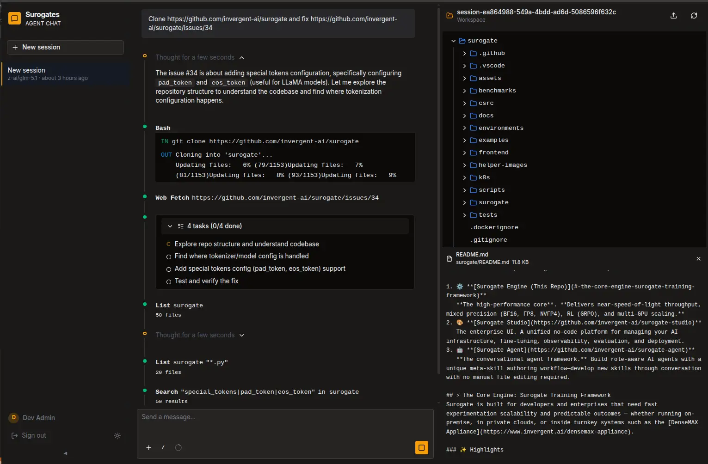
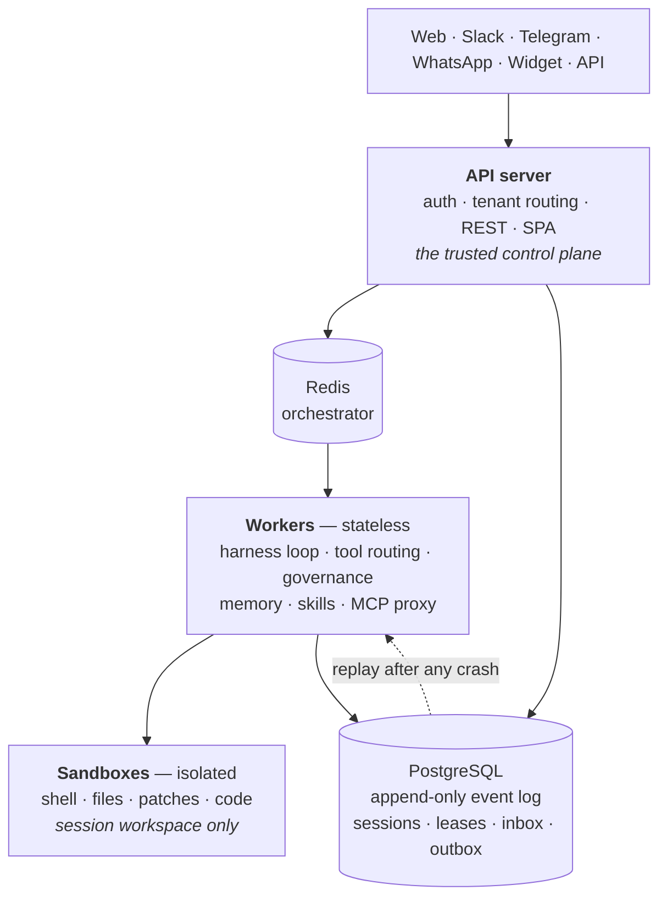

<div align="center">

# Surogates

**The open runtime for managed AI agents.**

Durable sessions. Isolated execution. Governance on every tool call.
Agents that survive a crash, a restart, and a bad decision.

[](LICENSE.AGPL-3.0)
[](https://www.python.org)
[](https://nodejs.org)
[](https://github.com/invergent-ai/surogates/stargazers)

[**Documentation**](docs/index.md) · [**Quick start**](#quick-start) · [**Architecture**](#architecture) · [**Watch it work**](#watch-it-work) · [**surogate.ai**](https://surogate.ai)

</div>

<br />



<br />

## Why Surogates

Most agent frameworks are a loop around an LLM call. That is the easy part. It
falls over the moment an agent has to run for an hour, touch a real system, or
be trusted by someone other than the person who wrote it.

Surogates is the part that comes after the loop:

|  | |
|---|---|
| **It survives** | Every session is an append-only event log in PostgreSQL. Kill the worker mid-tool-call and the next one replays the log and carries on. Workers are stateless; any of them can serve any session. |
| **It is contained** | A hard brain/hands split. Workers run the reasoning loop. Sandboxes — Kubernetes pods in production — run the untrusted code, with a session-scoped workspace and a network policy around them. |
| **It is governed** | Every tool call passes a policy engine before it executes: allow-lists, deny-lists, ABAC rules, file-path containment. Policy is frozen per session, so a prompt injection mid-conversation cannot widen it. |
| **It is multi-tenant** | Storage, credentials, skills, memory, MCP config, policy and rate limits are all tenant-scoped. Sandboxes never see tenant secrets — the MCP proxy injects credentials on the way out. |
| **It goes where users are** | Web, Slack, Telegram, WhatsApp, an embeddable website widget, and an OpenAI-compatible API — the same agent, the same session store, six front doors. |

## Watch it work

Short, narrated walkthroughs of the runtime — missions, browser control, deep
research, governance, and the session record.

**▶ [youtube.com/@Surogate_ai](https://www.youtube.com/@Surogate_ai)**

<!-- TODO: replace the channel link above with per-video thumbnail cards once the
     video IDs are in hand, e.g.
     [](https://youtu.be/<ID>)
     Candidates already rendered: hand-it-a-mission, use-a-browser,
     deep-research, research-missions, coding-agents, loops, goals, approvals,
     governance, read-a-session, put-it-in-slack. -->

## Quick start

One command builds a local Kubernetes cluster with everything Surogates needs —
PostgreSQL, Redis, S3-compatible storage, ingress and TLS:

```bash
git clone https://github.com/invergent-ai/surogates
cd surogates/k8s && ./setup-cluster.sh
```

It installs `kubectl`, `helm`, `k3d` and `mkcert` into `~/.surogates/bin/` if
they are missing, then writes a filled-in `~/.surogates/config.yaml`.

Point it at any OpenAI-compatible model:

```yaml
llm:
  model: "claude-sonnet-4-20250514"
  base_url: "https://api.anthropic.com/v1"
  api_key: "sk-ant-..."
```

Then run the control plane and a worker:

```bash
export SUROGATES_CONFIG=~/.surogates/config.yaml
surogates api      # REST API + web chat UI
surogates worker   # pulls sessions off Redis, runs the harness
```

Full walkthrough: **[Getting Started](docs/getting-started/index.md)**.

## Drive it from code

Sessions are REST. Create one, send it work, stream the result back:

```bash
# Create a session
curl -X POST https://your-host/v1/sessions \
  -H "Authorization: Bearer $TOKEN" \
  -H "Content-Type: application/json" \
  -d '{"system": "Answer only in SQL. Never write prose."}'
# → {"session_id": "…", "status": "active"}

# Give it something to do
curl -X POST https://your-host/v1/sessions/$SID/messages \
  -H "Authorization: Bearer $TOKEN" \
  -H "Content-Type: application/json" \
  -d '{"content": "Which customers churned last quarter?"}'
# → {"event_id": 42, "status": "processing"}

# Watch it think, over SSE
curl -N https://your-host/v1/sessions/$SID/events \
  -H "Authorization: Bearer $TOKEN"
```

The same endpoint replays from any point in the log, so a dropped connection
costs nothing. Full surface: **[REST API Reference](docs/appendices/api-reference.md)**.

## What it can do

### Long-horizon work

<details open>
<summary><b>Missions, tasks and a DAG that remembers</b></summary>

<br />

Tasks are database rows, not in-memory promises. Each wraps zero or more attempt
sessions with a goal, optional `parents=[...]` for fan-in, structured results,
and a `todo → ready → running → done/blocked/failed/cancelled` state machine. A
5-second dispatcher promotes ready tasks, finalises attempts and retries crashes
up to `max_attempts` — with the prior attempts injected into the retry's context
so it does not repeat itself.

**Missions** sit on top: `/mission <description>` plus a written rubric. A
coordinator decomposes the goal into work tasks and a verifier task, and an LLM
judge grades the workstream whenever a task terminates — `satisfied`,
`needs_revision`, `blocked` or `failed`. Pause, resume and cancel without losing
in-flight workers.

→ [Tasks and Missions](docs/tasks/index.md)

</details>

<details>
<summary><b>Research missions — a tree search over ideas</b></summary>

<br />

Turns "improve this benchmark" into a cumulative search. A coordinator grows a
durable **Idea Tree** of hypotheses; ephemeral executors implement and evaluate
each one in an isolated git worktree; a verified gain merges into a protected
trunk **only after an independently re-run held-out evaluation**. Executors
cannot merge their own claims, so progress cannot be faked.

→ [Research Missions](docs/research-missions/index.md)

</details>

<details>
<summary><b>Deep research — planner and writer, with citations</b></summary>

<br />

A two-agent pipeline that turns an open-ended question into a long-form,
citation-grounded report. Opt-in per agent, with guards against runaway
iteration and dangling citations.

→ [Deep Research](docs/deep-research/index.md)

</details>

<details>
<summary><b>The coordination board — parallel agents that aren't blind</b></summary>

<br />

When a session fans out, the whole tree shares one board of compact, typed
notes. Workers post what they learn and every member — siblings, retries and the
coordinator — reads it directly, instead of results dribbling upward one parent
at a time. A dead end hit by worker 1 becomes a `FAIL` note that worker 2 reads
*before* repeating it.

→ [Coordination Board](docs/board/index.md)

</details>

<details>
<summary><b>Goals and loops</b></summary>

<br />

`/goal <description>` defines an outcome with a rubric; Surogates works the
conversation, grades each response and appends continuations until the evaluator
returns `satisfied`, `blocked` or `failed`. `/loop [interval] <prompt>` schedules
recurring work — a fixed `5m`/`1h`/`2d`, or dynamic self-pacing.

→ [Goals](docs/goals/index.md) · [Commands](docs/commands/index.md)

</details>

### Hands on the real world

<details>
<summary><b>Browser control, with a human handoff</b></summary>

<br />

Agents drive a real session-scoped Chromium: navigate, click, type, scroll,
read the accessibility tree, screenshot. When it hits a login, MFA or CAPTCHA it
hands the browser to the user, waits, and continues in the same session.

→ [Browser Use](docs/browser-use/index.md)

</details>

<details>
<summary><b>Tools, and MCP that doesn't leak secrets</b></summary>

<br />

Built-in tools for shell, files, patching, code execution, web search,
extraction, crawling, vision, memory, skills, delegation and scheduling. MCP
servers over stdio and HTTP with OAuth 2.1 PKCE.

The proxy injects credentials on the way out, so **sandboxes never see tenant
secrets**. Tool definitions are scanned for prompt injection, invisible unicode
and schema abuse, and SHA-256 fingerprinted to catch rug-pulls.

→ [Tools](docs/tools/index.md) · [MCP Integration](docs/mcp-integration/index.md)

</details>

<details>
<summary><b>Skills, sub-agents and experts</b></summary>

<br />

**Skills** are reusable prompt-based behaviours layered platform → org → user.
**Sub-agents** are declarative child presets with their own prompt, tool
envelope, model override, iteration cap and policy profile. **Experts** are
task-specialised models or scoped mini-loops, retrainable from the event log
the runtime already collects.

→ [Skills](docs/skills/index.md) · [Sub-Agents](docs/sub-agents/index.md) · [Experts](docs/experts/index.md)

</details>

<details>
<summary><b>Memory that is just files</b></summary>

<br />

`MEMORY.md` for durable project knowledge, `USER.md` for user preferences.
Frozen snapshots are injected at session start; updates are security-scanned and
deduplicated before storage.

→ [Memory](docs/memory/index.md)

</details>

### Safe enough to hand to a customer

<details>
<summary><b>Governance, audit and the blast radius</b></summary>

<br />

A policy engine on every tool call — allow-lists, deny-lists, ABAC rules and
file-path containment — immutable once a session is frozen. Policy profiles
narrow what child sessions may do. Sandboxes are network-isolated by Kubernetes
NetworkPolicy. Credentials live in a vault encrypted at rest, scoped per org and
per user. Saga tracking compensates a multi-step tool chain when a later step
fails. Sliding-window rate limits per org and per user.

Everything lands in the session event log and a tenant audit log, with SQL views
for compliance, debugging, dashboards and training data.

→ [Governance and Security](docs/governance-and-security/index.md) · [Audit & Observability](docs/audit/index.md)

</details>

<details>
<summary><b>Six ways in</b></summary>

<br />

| Channel | What it is |
|---|---|
| **Web** | Streaming chat UI with session management and workspace browsing |
| **Slack** | Socket Mode — DMs, @mentions, threads, files, multi-workspace |
| **Telegram** | DMs, groups, forum topics, media, fallback transport for restricted networks |
| **WhatsApp** | Official Business Cloud API, per-tenant Meta app. Reactive by design, so the 24-hour window never applies |
| **Website widget** | Embeddable widget for anonymous visitors — publishable-key auth, CORS allow-list, CSRF-protected sessions |
| **API** | OpenAI-compatible chat completions plus fire-and-forget submission for batch pipelines |

→ [Channels](docs/channels/index.md) · [Agent Inbox](docs/agent-inbox/index.md)

</details>

## Architecture

Three tiers, decoupled so each can fail, scale and be governed on its own.


```mermaid
flowchart TD
    C["Web · Slack · Telegram · WhatsApp · Widget · API"]
    C --> API["<b>API server</b><br/>auth · tenant routing · REST · SPA<br/><i>the trusted control plane</i>"]
    API --> R[("Redis<br/>orchestrator")]
    R --> W["<b>Workers</b> — stateless<br/>harness loop · tool routing · governance<br/>memory · skills · MCP proxy"]
    W --> S["<b>Sandboxes</b> — isolated<br/>shell · files · patches · code<br/><i>session workspace only</i>"]
    W --> DB[("PostgreSQL<br/>append-only event log<br/>sessions · leases · inbox · outbox")]
    API --> DB
    DB -. "replay after any crash" .-> W
```

Workers hold no state, so any worker can serve any session. Sandboxes get a
session-scoped workspace and nothing else. If either dies, the next run resumes
from the log.

→ [Architecture](docs/architecture/index.md) · [Multi-Tenancy](docs/multi-tenancy/index.md)

## Repository layout

| Path | Purpose |
|---|---|
| `surogates/` | Python backend — API server, worker harness, tools, storage, governance, jobs |
| `web/` | React web application for the hosted chat UI |
| `sdk/agent-chat-react/` | Shared React chat and inbox components |
| `sdk/website-widget/` | Embeddable website widget SDK |
| `docs/` | User, operator and architecture documentation |
| `k8s/` | Cluster setup script and manifests |
| `tests/` | Backend unit and integration tests |

## Development

```bash
uv sync                                  # Python deps
uv run pytest                            # backend tests
cd web && npm run typecheck && npm run build
cd sdk/agent-chat-react && npm test
```

Some integration tests need PostgreSQL, Redis, Docker, browser images or
Kubernetes, depending on the marker.

## Documentation

**Start here** — [Introduction](docs/intro/index.md) · [Getting Started](docs/getting-started/index.md) · [Architecture](docs/architecture/index.md) · [Glossary](docs/appendices/glossary.md)

**Build with it** — [Tools](docs/tools/index.md) · [Skills](docs/skills/index.md) · [Sub-Agents](docs/sub-agents/index.md) · [Experts](docs/experts/index.md) · [MCP](docs/mcp-integration/index.md) · [Memory](docs/memory/index.md) · [Commands](docs/commands/index.md)

**Long-horizon work** — [Tasks and Missions](docs/tasks/index.md) · [Goals](docs/goals/index.md) · [Research Missions](docs/research-missions/index.md) · [Deep Research](docs/deep-research/index.md) · [Coordination Board](docs/board/index.md)

**Reach users** — [Channels](docs/channels/index.md) · [Agent Inbox](docs/agent-inbox/index.md) · [Browser Use](docs/browser-use/index.md)

**Run it** — [Multi-Tenancy](docs/multi-tenancy/index.md) · [Governance and Security](docs/governance-and-security/index.md) · [Audit](docs/audit/index.md) · [Storage](docs/storage/index.md) · [Background Jobs](docs/background-jobs/index.md) · [Operations](docs/operations/index.md) · [Configuration](docs/appendices/configuration.md) · [REST API](docs/appendices/api-reference.md)

## Contributing

Contributions that improve reliability, security, documentation and
interoperability are welcome. Surogates builds on ideas from:

[Anthropic — Building Effective Agents](https://www.anthropic.com/engineering/building-effective-agents) ·
[Anthropic Sandbox Runtime](https://github.com/anthropic-experimental/sandbox-runtime) ·
[Microsoft Agent Governance Toolkit](https://github.com/microsoft/agent-governance-toolkit) ·
[Hermes Agent](https://github.com/NousResearch/hermes-agent) ·
[OpenClaw](https://github.com/openclaw/openclaw) ·
[NVIDIA OpenShell](https://github.com/NVIDIA/OpenShell)

## License

[AGPL-3.0-only](LICENSE.AGPL-3.0).

<div align="center">
<br />

**Built by [Invergent](https://invergent.ai)** · [surogate.ai](https://surogate.ai) · [Discord](https://discord.gg/HC3Vypejv9) · [X](https://x.com/surogate_ai)

<sub>If Surogates is useful to you, a ⭐ helps other people find it.</sub>

</div>
