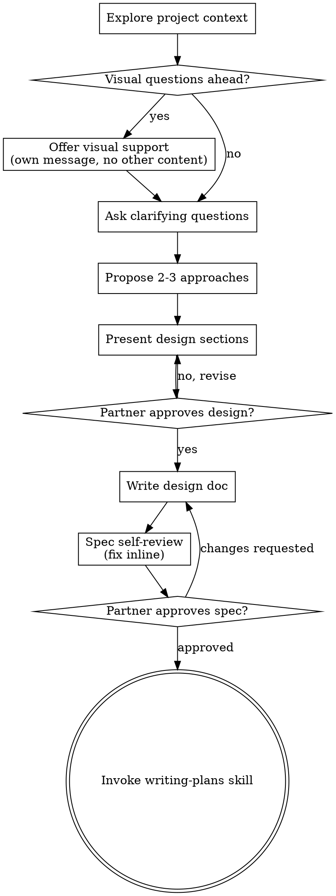

# Brainstorming Ideas Into Designs

Help turn your human partner's idea into a fully formed design through natural collaborative dialogue.

Start by understanding the current project context, then ask questions one at a time to refine the idea. Once you understand what is being built, present the design and get approval before any implementation skill is invoked.

<HARD-GATE>
Do NOT invoke any implementation skill, write any code, create any artifact, scaffold any project, or take any implementation action until you have presented a design and your human partner has approved it. This applies to EVERY task regardless of perceived simplicity.
</HARD-GATE>

## Anti-Pattern: "This Is Too Simple To Need A Design"

Every task goes through this process. A todo list, a single-function utility, a config change, a short report — all of them. "Simple" projects are where unexamined assumptions cause the most wasted work. The design can be short (a few sentences for truly simple work), but you MUST present it and get approval.

## Checklist

You MUST create a `todo` for each of these items and complete them in order:

1. **Explore project context** — check files, docs, recent activity
2. **Offer visual support** (if upcoming questions will involve visual content) — see Visuals section. This is its own message, not combined with a clarifying question.
3. **Ask clarifying questions** — one at a time, understand purpose / constraints / success criteria
4. **Propose 2-3 approaches** — with trade-offs and your recommendation
5. **Present design** — in sections scaled to their complexity, get approval after each section
6. **Write design doc** — save to `.surogate/specs/YYYY-MM-DD-<topic>.md`
7. **Spec self-review** — inline check for placeholders, contradictions, ambiguity, scope (see below)
8. **Partner reviews written spec** — ask your human partner to review the spec file before proceeding
9. **Transition to implementation** — invoke `writing-plans` via `skill_view` to create the implementation plan

## Process Flow

**The terminal state is invoking `writing-plans`.** Do NOT invoke any other implementation-shaped skill after brainstorming. The ONLY skill you invoke next is `writing-plans`.

## The Process

**Understanding the idea:**

- Check out the current project state first (files, docs, recent activity).
- Before asking detailed questions, assess scope: if the request describes multiple independent subsystems (e.g., "build a platform with chat, file storage, billing, and analytics"), flag this immediately. Don't spend questions refining details of work that needs to be decomposed first.
- If the work is too large for a single spec, help your human partner decompose into sub-projects: what are the independent pieces, how do they relate, what order should they be built? Then brainstorm the first sub-project through the normal design flow. Each sub-project gets its own spec → plan → implementation cycle.
- For appropriately-scoped work, ask questions one at a time to refine the idea.
- Prefer multiple-choice questions via `ask_user_question` when feasible (faster to answer). Open-ended is fine too.
- Only one question per message — if a topic needs more exploration, break it into multiple questions.
- Focus on understanding: purpose, constraints, success criteria.

**Exploring approaches:**

- Propose 2-3 different approaches with trade-offs.
- Present options conversationally with your recommendation and reasoning.
- Lead with your recommended option and explain why.

**Presenting the design:**

- Once you believe you understand what is being built, present the design.
- Scale each section to its complexity: a few sentences if straightforward, up to 200-300 words if nuanced.
- Ask after each section whether it looks right so far.
- For software work, cover: architecture, components, data flow, error handling, testing. For other work, cover the analogous structure (e.g., document outline, section ownership, source material, review path).
- Be ready to go back and clarify if something doesn't make sense.

**Design for isolation and clarity:**

- Break the work into smaller units that each have one clear purpose, communicate through well-defined interfaces, and can be understood and tested independently.
- For each unit, you should be able to answer: what does it do, how do you use it, and what does it depend on?
- Can someone understand what a unit does without reading its internals? Can you change the internals without breaking consumers? If not, the boundaries need work.

**Working in existing projects:**

- Explore the current structure before proposing changes. Follow existing patterns.
- Where existing material has problems that affect the work (an oversized file, unclear boundaries, tangled responsibilities), include targeted improvements as part of the design — the way a thoughtful collaborator improves what they're working in.
- Don't propose unrelated refactoring. Stay focused on what serves the current goal.

## After the Design

**Documentation:**

- Write the validated design (spec) to `.surogate/specs/YYYY-MM-DD-<topic>.md` using `write_file`.
- Your human partner's preferences for spec location override this default.

**Spec Self-Review:**

After writing the spec, look at it with fresh eyes:

1. **Placeholder scan:** Any "TBD", "TODO", incomplete sections, or vague requirements? Fix them.
2. **Internal consistency:** Do any sections contradict each other? Does the architecture match the feature descriptions?
3. **Scope check:** Is this focused enough for a single implementation plan, or does it need decomposition?
4. **Ambiguity check:** Could any requirement be interpreted two different ways? If so, pick one and make it explicit.

Fix issues inline. No need to re-review — just fix and move on.

**Optional external review:** For a high-stakes spec, dispatch a reviewer via `delegate_task` using the template at [references/spec-reviewer-prompt.md](references/spec-reviewer-prompt.md). The reviewer returns status, issues, recommendations. Apply changes and re-review.

**Partner Review Gate:**

After the spec review pass, ask your human partner to review the written spec before proceeding:

> "Spec written and saved to `<path>`. Please review it and let me know if you want to make any changes before we start writing out the implementation plan."

Wait for their response. If they request changes, make them and re-run the spec review. Only proceed once they approve.

**Implementation:**

- Invoke the `writing-plans` skill via `skill_view("writing-plans")` to create a detailed implementation plan.
- Do NOT invoke any other skill at this point. `writing-plans` is the next step.

## Key Principles

- **One question at a time** — Don't overwhelm with multiple questions.
- **Multiple choice preferred** — Easier to answer than open-ended when possible. Use `ask_user_question` when the platform supports it.
- **YAGNI ruthlessly** — Remove unnecessary features from all designs.
- **Explore alternatives** — Always propose 2-3 approaches before settling.
- **Incremental validation** — Present design, get approval before moving on.
- **Be flexible** — Go back and clarify when something doesn't make sense.

## Visuals

When a question is fundamentally visual — mockups, layouts, diagrams, side-by-side comparisons — use the `create_artifact` tool to render the visual inline as HTML, SVG, or a chart. Visual content the human partner can *see* beats descriptions of it.

**Offering visual support:** When you anticipate upcoming questions will involve visual content, offer it once for consent:

> "Some of what we're working on might be easier to show than describe. I can render mockups, diagrams, and side-by-side options inline as artifacts when it would help. Want me to do that when relevant?"

**This offer MUST be its own message.** Do not combine it with clarifying questions, context summaries, or any other content. Wait for the response before continuing.

**Per-question decision:** Even after they accept, decide FOR EACH QUESTION whether the visual treatment helps. The test: **would my human partner understand this better by seeing it than by reading it?**

- **Use an artifact** for content that IS visual — mockups, wireframes, layout comparisons, architecture diagrams, side-by-side designs.
- **Use text** for content that is text — requirements questions, conceptual choices, tradeoff lists, scope decisions, A/B/C text options.

A question on a UI topic is not automatically a visual question. "What does 'personality' mean here?" is conceptual — use text. "Which wizard layout works better?" is visual — use an artifact.

When you do use an artifact, keep it tight: one option per artifact unless directly comparing. Don't burn turns producing artwork no one asked for.
