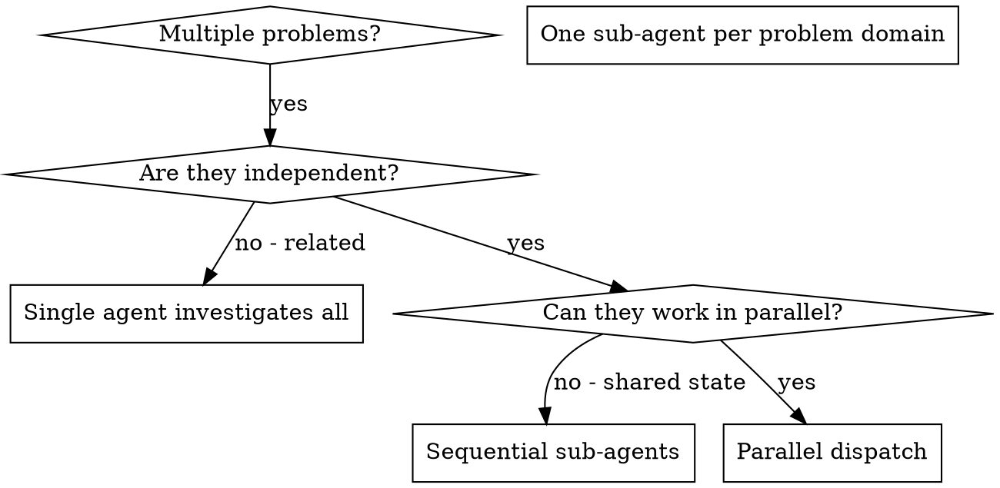

# Dispatching Parallel Agents

## Overview

You delegate tasks to specialized sub-agents with isolated context. By precisely crafting their instructions and context, you ensure they stay focused and succeed at their task. They never inherit your session's context or history — you construct exactly what they need. This also preserves your own context for coordination work.

When you have multiple unrelated problems (different files, different subsystems, different bugs, different research domains), investigating them sequentially wastes time. Each investigation is independent and can happen in parallel.

**Core principle:** Dispatch one sub-agent per independent problem domain. Let them work concurrently.

## When to Use



**Use when:**
- 3+ test files failing with different root causes.
- Multiple subsystems broken independently.
- Each problem can be understood without context from the others.
- No shared state between investigations.
- Research across distinct domains (e.g., "how does X work?" + "how does Y work?" + "how does Z work?").

**Don't use when:**
- Failures are related (fix one might fix others).
- You need to understand full system state.
- Sub-agents would interfere with each other (shared files, shared resources).

## Dispatch Tools (Surogates)

Two surogates tools dispatch sub-agents. Pick based on what you need back.

- **`delegate_task(goal, context, agent_type=...)`** — One-shot focused work in a fresh session. Returns the sub-agent's final response. Use when you want a synthesized answer back: research, review, focused investigation, focused fix.
- **`spawn_worker(goal, agent_type=...)`** — Spawn a coordinator-style worker. Returns immediately with a `worker_id`; results arrive as later user-role messages with a `[Worker ... completed]` prefix. Use when you want to do other work while the sub-agent runs, or when you need to send follow-ups via `send_worker_message`.

For straightforward parallel investigation/fix work, `delegate_task` is usually the right tool — call it multiple times in the same response to fan out.

## The Pattern

### 1. Identify Independent Domains

Group problems by what's broken (or what's being researched):

- File A tests: Tool approval flow.
- File B tests: Batch completion behavior.
- File C tests: Abort functionality.

Each domain is independent — fixing tool approval doesn't affect abort tests.

### 2. Create Focused Sub-Agent Tasks

Each sub-agent gets:

- **Specific scope:** One file, one subsystem, one research question.
- **Clear goal:** What "done" looks like.
- **Constraints:** What NOT to change.
- **Expected output:** Summary of what they found and what they changed.

### 3. Dispatch in Parallel

Call the dispatch tool multiple times in the **same response** to fan out:

```
delegate_task(goal="Fix failures in agent-tool-abort.test.ts", context="...")
delegate_task(goal="Fix failures in batch-completion-behavior.test.ts", context="...")
delegate_task(goal="Fix failures in tool-approval-race-conditions.test.ts", context="...")
```

All three execute concurrently. The harness gathers results before your next turn.

### 4. Review and Integrate

When sub-agents return:

- Read each summary.
- Verify fixes don't conflict (did two sub-agents edit the same file?).
- Run the full verification (test suite, lint, type check).
- Integrate all changes.

## Sub-Agent Prompt Structure

Good sub-agent prompts are:

1. **Focused** — One clear problem domain.
2. **Self-contained** — All context needed to understand the problem.
3. **Specific about output** — What should the sub-agent return?

```
delegate_task(
  goal="Fix the 3 failing tests in src/agents/agent-tool-abort.test.ts",
  context="""
    Failing tests:
    1. "should abort tool with partial output capture" — expects 'interrupted at' in message
    2. "should handle mixed completed and aborted tools" — fast tool aborted instead of completed
    3. "should properly track pendingToolCount" — expects 3 results but gets 0

    These look like timing / race condition issues.

    Your task:
    1. Read the test file and understand what each test verifies.
    2. Identify the root cause — timing issues or actual bugs?
    3. Fix by:
       - Replacing arbitrary timeouts with event-based waiting.
       - Fixing bugs in the abort implementation if found.
       - Adjusting test expectations if testing the wrong behavior.

    Do NOT just increase timeouts — find the real issue.

    Return: Summary of what you found and what you changed.
  """,
)
```

## Common Mistakes

**Too broad:** "Fix all the tests" — sub-agent gets lost.
**Specific:** "Fix `agent-tool-abort.test.ts`" — focused scope.

**No context:** "Fix the race condition" — sub-agent doesn't know where.
**Context:** Paste the error messages and test names.

**No constraints:** Sub-agent might refactor everything.
**Constraints:** "Do NOT change production code" or "Fix tests only".

**Vague output:** "Fix it" — you don't know what changed.
**Specific:** "Return summary of root cause and changes".

**Lazy delegation:** "Based on your findings, fix the issue."
**Synthesized:** Do the synthesis yourself, then give the sub-agent a concrete spec.

## When NOT to Use

- **Related failures:** Fixing one might fix others — investigate together first.
- **Need full context:** Understanding requires seeing the entire system.
- **Exploratory debugging:** You don't know what's broken yet.
- **Shared state:** Sub-agents would interfere (editing same files, using same resources).

## Verification

After sub-agents return:

1. **Review each summary** — understand what changed.
2. **Check for conflicts** — did sub-agents edit the same code or write to the same file?
3. **Run the full verification** — tests, lint, type check.
4. **Spot check** — sub-agents can make systematic errors; trust but verify.

## Key Benefits

1. **Parallelization** — Multiple investigations happen simultaneously.
2. **Focus** — Each sub-agent has narrow scope, less context to track.
3. **Independence** — Sub-agents don't interfere with each other.
4. **Speed** — N problems solved in the time of 1.
5. **Context discipline** — Your coordinator context stays clean for synthesis.

## Real Example

**Scenario:** 6 test failures across 3 files after a refactor.

**Failures:**
- `agent-tool-abort.test.ts`: 3 failures (timing issues).
- `batch-completion-behavior.test.ts`: 2 failures (tools not executing).
- `tool-approval-race-conditions.test.ts`: 1 failure (execution count = 0).

**Decision:** Independent domains — abort logic separate from batch completion separate from race conditions.

**Dispatch (same response, three `delegate_task` calls):**
- Sub-agent 1 → Fix `agent-tool-abort.test.ts`.
- Sub-agent 2 → Fix `batch-completion-behavior.test.ts`.
- Sub-agent 3 → Fix `tool-approval-race-conditions.test.ts`.

**Results:**
- Sub-agent 1: Replaced timeouts with event-based waiting.
- Sub-agent 2: Fixed event-structure bug (threadId in wrong place).
- Sub-agent 3: Added wait for async tool execution to complete.

**Integration:** All fixes independent, no conflicts, full suite green.

**Time saved:** 3 problems solved in parallel vs. sequentially.
